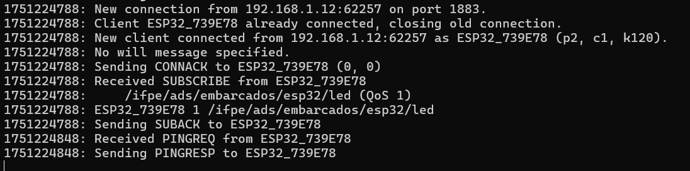
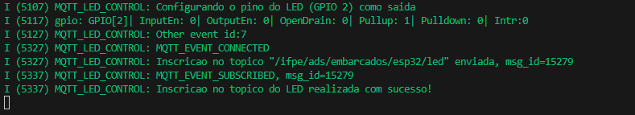
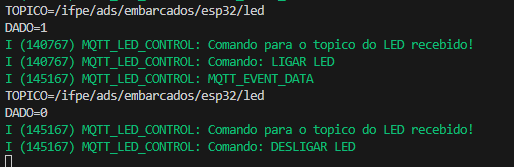

# Projeto de Controle de LED via MQTT com ESP32 e Broker Local

Este projeto implementa um cliente MQTT em um microcontrolador ESP32 utilizando o framework ESP-IDF. O dispositivo se conecta a um broker MQTT local (Mosquitto) para controlar o estado de seu LED embutido, respondendo a mensagens publicadas em um tópico específico.


---

## Descrição do Projeto

O objetivo deste projeto é demonstrar o uso do protocolo MQTT para comunicação M2M (Machine-to-Machine) em um sistema embarcado com um ecossistema totalmente local. O ESP32 atua como um cliente que:

1.  Conecta-se a uma rede Wi-Fi local pré-configurada.
2.  Conecta-se a um broker MQTT Mosquitto rodando na mesma rede local (no computador do usuário).
3.  Inscreve-se (subscribes) no tópico: `/ifpe/ads/embarcados/esp32/led`.
4.  Aguarda por mensagens nesse tópico e controla o estado do LED (GPIO 2) com base no conteúdo da mensagem recebida:
    * **Payload `1`**: Acende o LED.
    * **Payload `0`**: Apaga o LED.

## Hardware e Software Utilizados

### Hardware
* Placa ESP32.
* Cabo USB para alimentação e programação.

### Software e Ferramentas
* **Visual Studio Code** com a extensão oficial **ESP-IDF** da Espressif.
* **Git** para controle de versão.
* **Mosquitto MQTT Broker** para Windows.

---

##  Análise do Código (Pontos-Chave)

O funcionamento do projeto se concentra em alguns pontos críticos no arquivo `app_main.c`.


### O "Cérebro" da Comunicação: `mqtt_event_handler`
Esta função é o coração da lógica MQTT. Ela é chamada automaticamente sempre que ocorre um evento relacionado à conexão.

#### 1. Conexão e Inscrição no Tópico (`MQTT_EVENT_CONNECTED`)
```c
case MQTT_EVENT_CONNECTED:
    ESP_LOGI(TAG, "MQTT_EVENT_CONNECTED");
    const char* led_topic = "/ifpe/ads/embarcados/esp32/led";
    msg_id = esp_mqtt_client_subscribe(client, led_topic, 1);
    break;
```
Assim que o ESP32 se conecta com sucesso ao broker Mosquitto, este trecho de código é executado. Ele imediatamente envia um comando para se inscrever no tópico `/ifpe/ads/embarcados/esp32/led`. A partir deste momento, o broker sabe que deve encaminhar todas as mensagens deste tópico para o nosso ESP32.

#### 2. Recebimento e Processamento dos Dados (`MQTT_EVENT_DATA`)
```c
case MQTT_EVENT_DATA:
    // ...
    if (strncmp(event->topic, "/ifpe/ads/embarcados/esp32/led", event->topic_len) == 0) {
        if (strncmp(event->data, "1", event->data_len) == 0) {
            gpio_set_level(LED_PIN, 1); // Acende o LED
        } else if (strncmp(event->data, "0", event->data_len) == 0) {
            gpio_set_level(LED_PIN, 0); // Apaga o LED
        }
    }
    break;
```
Este é o bloco de código mais importante para a funcionalidade do projeto. Quando uma mensagem MQTT chega:
* **Primeiro `if`**: Ele verifica se o tópico da mensagem recebida é exatamente o tópico que nos interessa.
* **Segundo `if/else if`**: Ele compara o conteúdo da mensagem (o payload). Se o conteúdo for a string `"1"`, ele chama a função `gpio_set_level` para acender o LED. Se for `"0"`, ele chama a mesma função para apagar o LED.

### Orquestrador Principal: `app_main`
```c
void app_main(void)
{
    // ... inicializações ...

    ESP_ERROR_CHECK(example_connect()); // Conecta ao Wi-Fi
    configure_led();                    // Configura o pino do LED como saída
    mqtt_app_start();                   // Inicia o cliente MQTT

    while (1) {
        vTaskDelay(pdMS_TO_TICKS(1000));
    }
}
```
Esta é a função de entrada da aplicação. Ela executa a sequência de inicialização na ordem correta: primeiro conecta ao Wi-Fi, depois prepara o hardware (o pino do LED) e, finalmente, inicia o cliente MQTT que ficará rodando em segundo plano. O loop `while(1)` no final é crucial para garantir que a tarefa principal não termine, mantendo o sistema estável.


## Como Executar o Projeto

Siga os passos abaixo para compilar e executar o projeto.

### 1. Preparação do Ambiente
* **Clone o repositório:**
    ```bash
    git clone [LINK_DO_SEU_REPOSITORIO_AQUI]
    cd [NOME_DA_PASTA_DO_PROJETO]
    ```
* **Instale o Mosquitto:** Baixe e instale o Mosquitto a partir do [site oficial](https://mosquitto.org/download/).

### 2. Inicie o Broker Mosquitto Local
É necessário ter um servidor MQTT rodando na sua rede para que o ESP32 possa se conectar.

* **Crie o arquivo de configuração:** Crie um arquivo de texto chamado `mosquitto.conf` em uma pasta de fácil acesso (ex: `C:\Users\SeuUsuario\Documentos`) com o seguinte conteúdo:
    ```ini
    listener 1883
    allow_anonymous true
    ```

* **Inicie o Broker:** Abra um terminal (CMD ou PowerShell) como Administrador e execute o seguinte comando, ajustando o caminho para o seu arquivo `.conf`:
    ```cmd
    "C:\Program Files\mosquitto\mosquitto.exe" -c "C:\Users\SeuUsuario\Documentos\mosquitto.conf" -v
    ```
    **Deixe esta janela do terminal aberta.** Ela é o seu servidor MQTT.

### 3. Configure e Grave o Firmware do ESP32

* **Descubra o IP do seu PC:** Abra um **novo** terminal e digite `ipconfig`. Anote o **"Endereço IPv4"** da sua conexão Wi-Fi (ex: `192.168.1.105`).

* **Configure o projeto no VSCode:**
    1.  Abra a pasta do projeto no VSCode.
    2.  Execute o `menuconfig` com o comando `idf.py menuconfig` ou pelo atalho do VSCode.
    3.  Navegue até `Example Connection Configuration` e configure o **SSID e a senha** da sua rede Wi-Fi.
    4.  Navegue até `Example Configuration` e configure o `(BROKER_URL) Broker URL` com o IP do seu PC. Exemplo: `mqtt://192.168.1.105`
    5.  Salve e saia.

* **Compile e Grave:** Use os comandos `flash` e `monitor` ou os botões do VSCode para gravar o firmware e iniciar o monitor serial. Você deverá ver o ESP32 se conectar ao Wi-Fi e ao seu broker Mosquitto local.

#### ESP32 se conectou ao broker



#### monitor device



### 4. Testando a Funcionalidade
Com tudo rodando, abra um **terceiro** terminal para enviar os comandos.

* Navegue até a pasta do Mosquitto:
    ```cmd
    cd "C:\Program Files\mosquitto"
    ```

* **Para LIGAR o LED**, publique a mensagem "1":
    ```cmd
    mosquitto_pub.exe -h 192.168.1.105 -t "/ifpe/ads/embarcados/esp32/led" -m "1"
    ```

    O comando está dizendo "Use a ferramenta de publicação do Mosquitto para enviar a mensagem '1' para o tópico '/ifpe/ads/embarcados/esp32/led', entregando-a ao servidor MQTT que está no endereço 192.168.1.105.

* **Para DESLIGAR o LED**, publique a mensagem "0":
    ```cmd
    mosquitto_pub.exe -h 192.168.1.105 -t "/ifpe/ads/embarcados/esp32/led" -m "0"
    ```
#### monitor device



Observe o LED físico na placa respondendo aos comandos e os logs nas janelas do Monitor Serial e do Broker Mosquitto.

---
